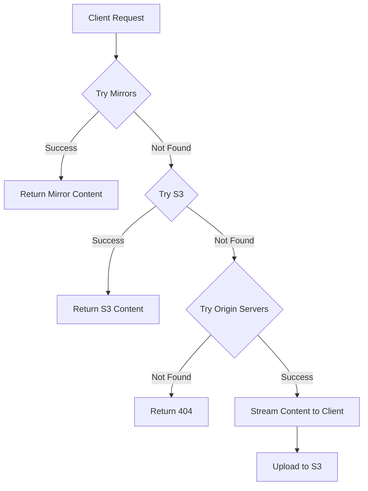

# nix-store-gateway

A simple gateway service that manages multiple layers of Nix binary cache backends efficiently.

1. **Fast Mirrors** – High-speed mirrors of the binary cache (e.g. [SJTUG](https://mirrors.sjtug.sjtu.edu.cn/docs/nix-channels/store)).
2. **S3 Storage** – Stores private packages and caches any missing packages from mirrors.
3. **Origin Binary Cache** – Fetches from the official Nix cache (e.g. [https://cache.nixos.org](https://cache.nixos.org)).

## Usage

To start the service:

```sh
./nix-store-gateway 127.0.0.1:3000 config.toml
```

Example `config.toml`:

```toml
[[mirrors]]
url = "https://mirror.sjtu.edu.cn/nix-channels/store/"

[[origins]]
url = "https://cache.nixos.org"

[[origins]]
url = "https://nix-community.cachix.org"

[s3]
endpoint = "https://S3-ENDPOINT"
bucket = "BUCKET_NAME"
region = "REGION_NAME"
access_key_id = "ACCESS_KEY_ID"
access_key_secret = "ACCESS_SECRET"
```

## How It Works


